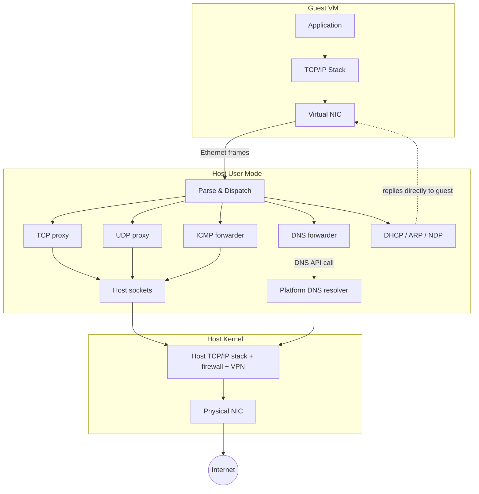

# Consomme

Consomme is a user-mode NAT that provides guest VM networking through
ordinary host sockets — no driver installation and no system-wide
network configuration. Because all traffic flows through standard
socket APIs, host networking policies (firewalls, VPN routing, proxy
settings) apply naturally, just as they would for any other application.

The guest sees a normal network: it gets an IP address via DHCP, has a
default gateway, and can resolve DNS names. Behind the scenes, Consomme
intercepts the raw Ethernet frames from the virtual NIC, parses them,
and translates them into socket calls on the host.

## Default network topology

| Role | IPv4 Address |
|------|-------------|
| Guest | `10.0.0.2` |
| Gateway | `10.0.0.1` |
| Subnet mask | `255.255.255.0` |

The subnet is configurable via the `--net consomme:<cidr>` CLI option.
The gateway is always `.1` and the guest is always `.2`.

IPv6 is enabled when the host has a routable IPv6 address. Consomme
advertises a prefix via SLAAC and the guest auto-configures its own
address. IPv6 DNS servers are advertised via RDNSS (in Router
Advertisements) and DHCPv6 Information-Request.

## Protocol handling

### TCP

Consomme maintains a full TCP state machine on the guest-facing side
and opens a real host socket per connection. Data flows through ring
buffers between the two sides. This is a split-TCP design: there are
two independent TCP connections (guest↔Consomme and host↔remote server)
stitched together.

Key implications of the split-TCP design:

- **Congestion control is disconnected from the real network.** The
  guest sees a virtual link with zero packet loss and sub-microsecond
  RTT. Its congestion window opens wide almost immediately. The host
  kernel's TCP stack handles all real congestion and retransmission.
- **Another TCP stack to debug.** When a connection stalls, there are
  three TCP implementations in play: the guest's, Consomme's, and the
  host kernel's. Diagnosing which one is misbehaving requires visibility
  into Consomme's internal state.

Consomme supports TCP Segmentation Offload (TSO) from the guest NIC,
window scaling, and MSS negotiation.

Inbound connections require explicit port forwarding — OpenVMM can
programmatically bind host ports and forward them into the guest.

### UDP

Each unique guest source socket (guest IP + source port) gets a
host-side UDP socket bound to an ephemeral port. Datagrams are
forwarded in both directions. Idle bindings are cleaned up after a
configurable timeout (5 minutes by default, per RFC 4787).

UDP packets to the gateway on well-known ports are intercepted:

- **Port 67** — handled by the built-in DHCP server
- **Port 53** — handled by the DNS forwarder

UDP segmentation offload and receive coalescing are not currently
supported. Each datagram requires a separate socket call, which may
matter for QUIC/HTTP/3 performance.

### DNS

The guest is told (via DHCP) to use the gateway as its DNS server.
Queries to the gateway on port 53 are intercepted and forwarded to the
host's DNS resolver. On Windows, this uses the `DnsQueryRaw` API, which
forwards the raw DNS packet without parsing — the host resolver handles
all the logic and returns a raw response. On Unix-like hosts, Consomme
uses the system resolver configuration (for example `/etc/resolv.conf`)
and forwards queries via host UDP/TCP sockets. This means guest DNS
resolution matches the host's behavior, including corporate VPNs and
split-tunnel DNS configurations.

DNS over TCP is also supported for large responses.

### ICMP

Echo requests (ping) are forwarded through a host-side ICMP socket.
The guest's TTL is preserved, so ping works and traceroute partially
works (the echo reply comes back, but intermediate TTL Exceeded hops
are not relayed — see limitations).

### ARP and NDP

- **ARP** — Responds to requests for the gateway MAC address. All other
  ARP traffic is dropped.
- **NDP** — Responds to Router Solicitations (advertising the IPv6
  prefix and DNS servers) and Neighbor Solicitations for the gateway's
  link-local address. DAD is silently ignored.

### DHCP

Built-in DHCPv4 server assigns the guest its IP address, gateway, and
DNS servers. Lease duration is 24 hours. DHCPv6 Information-Request is
also handled (stateless — provides DNS servers to SLAAC-configured
guests).

## Checksum and segmentation offload

Consomme supports the following offloads from the guest NIC:

- IPv4 header checksum offload
- TCP checksum offload
- UDP checksum offload
- TCP Segmentation Offload (TSO)

## Limitations

### No multicast or broadcast

Beyond ARP, DHCP, and the NDP multicast messages required for IPv6,
Consomme only processes unicast traffic. Protocols that rely on
multicast discovery do not work:

- **mDNS / Bonjour** — printer, AirPlay, Chromecast discovery
- **SSDP / UPnP** — device discovery, NAT-PMP port mapping
- **LLMNR** — Windows local name resolution fallback
- **NetBIOS** — legacy Windows browsing

### No ICMP error relay

ICMP error messages (Destination Unreachable, TTL Exceeded, etc.) are
not forwarded to the guest:

- **TCP** — unreachable hosts produce a TCP RST instead of an ICMP
  error. The connection fails, but the guest can't distinguish "host
  unreachable" from "connection refused."
- **UDP** — Port Unreachable errors are silently swallowed.
- **Traceroute** — TTL Exceeded replies from intermediate routers are
  not relayed, so the hop-by-hop path is not visible.

### No IP fragment reassembly

Fragmented IP packets from the guest are silently dropped. This only
affects UDP datagrams larger than ~1472 bytes. TCP is never affected
because the guest kernel segments at the TCP layer. On the host side,
fragmentation is handled transparently by the kernel socket layer.

### No jumbo frames

MTU is fixed at 1500 bytes.

### No ICMPv6 Echo

IPv6 ping does not work. IPv6 TCP and UDP work normally.

### No non-TCP/UDP/ICMP protocols

GRE, ESP, SCTP, and other IP protocols are silently dropped. This
means VPNs that terminate inside the guest and use IPsec (ESP) or
PPTP (GRE) will not work. UDP-based VPNs like WireGuard work fine.
IKEv2 with NAT-T (UDP-encapsulated ESP on port 4500) also works.

VPNs running on the host work transparently — Consomme's traffic flows
through the host network stack like any other application.

### IPv6 depends on host

IPv6 is only enabled if the host has a routable IPv6 address at VM
start time.

## Crate structure

| Crate | Path | Purpose |
|-------|------|---------|
| `consomme` | `vm/devices/net/net_consomme/consomme/` | Core user-mode TCP/IP stack |
| `net_consomme` | `vm/devices/net/net_consomme/` | [`net_backend::Endpoint`](https://openvmm.dev/rustdoc/linux/net_backend/trait.Endpoint.html) integration |
