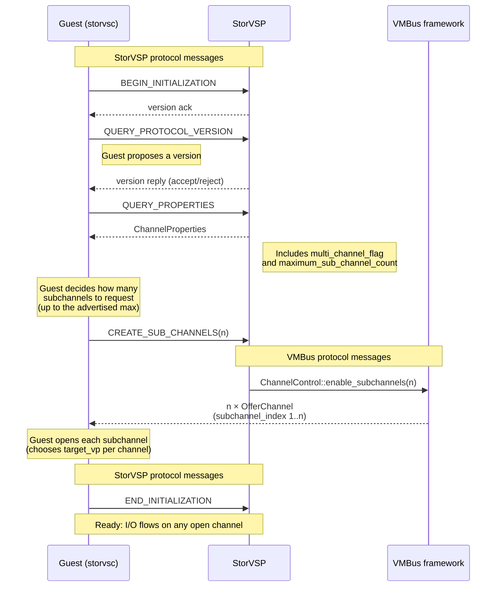
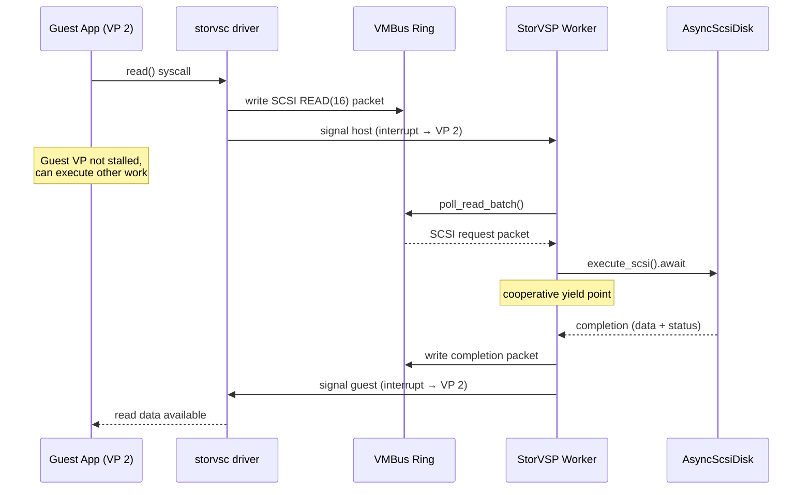
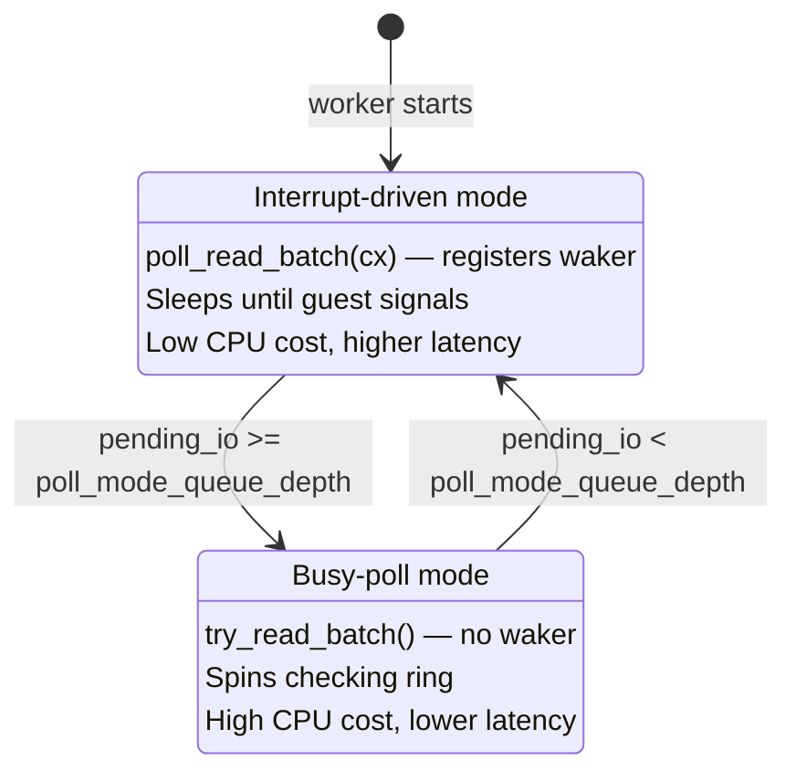

# StorVSP Channels & Subchannels

StorVSP uses VMBus channels and subchannels to
parallelize SCSI I/O across guest VPs. This page covers how StorVSP
negotiates subchannels, how the worker model maps to channels, and
the performance characteristics that matter in practice.

For the storage pipeline architecture, see
[Storage Pipeline](../../architecture/devices/storage.md).

## Subchannel negotiation

StorVSP and the guest `storvsc` driver negotiate subchannels through
the StorVSP protocol, a Hyper-V-specific wire format carried over
VMBus (for the protocol definition, see the
[`storvsp_protocol` rustdoc](https://openvmm.dev/rustdoc/linux/storvsp_protocol/index.html)
and the [StorVSP](storvsp.md) device page). The VMBus protocol handles
the underlying channel offers; the StorVSP protocol controls *how many*
subchannels are created.



Key points:

- The **host** advertises the maximum subchannel count via
  `ChannelProperties`. The **guest** decides how many to create (up to
  that maximum).
- `CREATE_SUB_CHANNELS` is a StorVSP protocol message. The resulting
  channel offers are VMBus protocol messages.
- The guest can also send `CREATE_SUB_CHANNELS` after initialization
  (in the Ready state).
- Multi-channel support requires StorVSP protocol version Win8 or later.
  Guest driver support:
  - **Linux:** `hv_storvsc` multi-channel support was added in kernel
    3.10 (2013).
  - **FreeBSD:** `hv_storvsc` multi-channel support landed in
    FreeBSD 12.2.
  - **Windows:** supported since Windows Server 2012 (the first
    release with the Win8 protocol version).

## Worker model

StorVSP runs **one async worker per open channel**. That means one
worker for the primary channel, plus one worker for each open
subchannel. A device with 3 subchannels has 4 workers total.
Each worker owns:

- A `Queue` wrapping the channel's ring buffer pair.
- A `FuturesUnordered` for concurrent SCSI request processing.
- Its own `max_io_queue_depth` limit.
- Per-worker statistics and inspect output.

```text
  StorVSP device instance
  ┌──────────────────────────────────────────────────┐
  │  Worker 0 (primary channel)                      │
  │    ├─ Protocol negotiation (init only)           │
  │    ├─ Queue (incoming + outgoing ring)           │
  │    └─ FuturesUnordered<ScsiRequest>              │
  ├──────────────────────────────────────────────────┤
  │  Worker 1 (subchannel 1)                         │
  │    ├─ Queue (own ring pair)                      │
  │    └─ FuturesUnordered<ScsiRequest>              │
  ├──────────────────────────────────────────────────┤
  │  Worker 2 (subchannel 2)                         │
  │    └─ ...                                        │
  └──────────────────────────────────────────────────┘
  All workers share: ScsiController (disk map), Protocol state
```

The **primary channel** handles protocol negotiation; subchannels wait
for the protocol to reach the Ready state before processing I/O.
If a guest sends I/O on a subchannel before protocol initialization
completes, the subchannel worker blocks (via an async listener) until
the primary channel finishes negotiation. The I/O is not lost, just
delayed. After initialization, all channels process I/O identically.

### I/O dispatch

There is no host-side steering. The guest chooses which channel to
write each I/O request into, typically matching the current VP to
the subchannel opened with that VP as the target. Each worker reads
only its own ring.

Outstanding I/O is capped **per channel** (per worker), not per
controller or per disk. Each worker has its own `max_io_queue_depth`.
When that many SCSI requests are in flight on a single channel,
the worker stops reading new requests from the ring until one
completes. Requests on other channels are unaffected.

## CPU affinity

Subchannels exist so the guest can place I/O close to the VP that
initiated it. This is the most important "why" behind subchannels.

### How targeting works

When a channel is opened, StorVSP creates the worker's async driver
targeted at the VP the guest specified. The strength of this targeting
depends on the executor backend:

```admonish note title="VP index = CPU number (today)"
The `target_vp` in the VMBus open request is a hypervisor VP index.
In OpenHCL, VP index is used directly as the Linux CPU number for
threadpool targeting. This is a simplifying assumption, not an
architectural guarantee.
```

### What happens during a read



The guest VP is **not stalled** during this process. Writing to the
ring and signaling the host are non-blocking operations in guest
memory and hypercall space. The VP can continue executing guest code
immediately after the signal. The guest kernel only blocks the
*application thread* when it does a synchronous `read()` syscall (the
kernel puts that thread to sleep until the completion interrupt
arrives). Other threads and other VPs continue running normally. The
VP itself is never taken out of VTL0 by the I/O submission.

### Retargeting

The guest can retarget a channel to a different VP via `ModifyChannel`.
This happens when VPs come online/offline (e.g., CPU hot-remove) and
the guest rebalances channel assignments. StorVSP forwards the
retarget to its worker's driver. Future work moves to the new VP's
thread, but in-flight I/Os complete on the old one.

### IDE accelerator comparison

The IDE accelerator uses StorVSP to back an IDE device via a VMBus
channel, replacing the slow PCI port-I/O emulation path with VMBus
ring buffers. However, the IDE accelerator sets
`max_sub_channel_count = 0`. All I/O is serialized through a single
channel. The accelerator exists for throughput (ring buffers are
faster than port-I/O VM exits), not for parallelism.

### Frontend comparison

| Frontend | VP affinity model |
|----------|-------------------|
| **StorVSP** (VMBus SCSI) | Guest chooses VP per channel. Subchannels = explicit multi-queue. One worker per channel, VP-targeted. |
| **NVMe** (emulated) | Guest creates submission queues mapped to VPs via MSI-X vectors. One async handler per completion queue. No VMBus — MMIO doorbells. |
| **IDE** (emulated) | Single channel, no subchannels. All I/O serialized through one path. |
| **IDE accelerator** | StorVSP-backed, but `max_sub_channel_count = 0`. Single channel. |

## Subchannel scaling

The number of subchannels determines how much parallelism is
available. Too few and I/O contends on shared rings; too many and
resources are wasted.

### 0 subchannels (default)

All I/O funnels through the primary channel: one ring, one worker.

```text
  Guest VPs          Channels              StorVSP Workers
  ┌──────┐
  │ VP 0 ├───┐       ┌─────────────┐       ┌──────────────┐
  └──────┘   ├──────►│ Primary (0) ├──────►│ Worker 0     │
  ┌──────┐   │       │  ring pair  │       │ all I/O      │
  │ VP 1 ├───┘       └─────────────┘       └──────────────┘
  └──────┘
```

On a 64-VP VM, this means 64 VPs would compete for one ring.
The single worker's `max_io_queue_depth` limits total
concurrency.

### One channel per VP (ideal)

Each VP gets its own channel. No ring contention, no cross-VP
serialization.

```text
  ┌──────┐           ┌─────────────┐       ┌──────────────┐
  │ VP 0 ├──────────►│ Primary (0) ├──────►│ Worker 0     │
  └──────┘           └─────────────┘       └──────────────┘
  ┌──────┐           ┌─────────────┐       ┌──────────────┐
  │ VP 1 ├──────────►│ Subchan (1) ├──────►│ Worker 1     │
  └──────┘           └─────────────┘       └──────────────┘
       ...                 ...                   ...
  ┌──────┐           ┌─────────────┐       ┌──────────────┐
  │ VP N ├──────────►│ Subchan (N) ├──────►│ Worker N     │
  └──────┘           └─────────────┘       └──────────────┘
```

Each channel costs a ring buffer GPADL and a worker task.

### Over-provisioned (subchannels > VPs)

The guest *could* open more channels than it has VPs. The protocol
doesn't prevent it. But there's no benefit. In practice,
guest drivers open at most one channel per VP. Extra subchannel
offers go unused.

### VP-to-channel assignment

The mapping of VPs to channels is entirely up to the guest driver.
The StorVSP protocol does not prescribe any assignment.

- **Linux** `storvsc` typically opens one subchannel per online VP
  and steers I/O by matching the current CPU to the corresponding
  channel (controlled by `storvsc_vcpus_per_sub_channel`).
- **Windows** `storvsc` also opens subchannels and distributes I/O
  across them, though the exact allocation strategy is not public.
- **FreeBSD** `hv_storvsc` supports multi-channel since FreeBSD 12.2
  with similar per-CPU steering as Linux.

## Performance characteristics

### Poll mode

StorVSP has two ring-reading modes, controlled by
`poll_mode_queue_depth` (default: 1). This value can be changed at
runtime via the inspect tree — it's stored as an `AtomicU32` and
exposed through `inspect::AtomicMut`:

```bash
# View current poll mode queue depth (replace GUID with your instance)
openvmm inspect vm/scsi:<INSTANCE_ID>/poll_mode_queue_depth

# Change it at runtime (e.g., to 8)
openvmm inspect vm/scsi:<INSTANCE_ID>/poll_mode_queue_depth --update 8
```

To find the instance ID, run `inspect vm` and look for the
`scsi:<guid>` entry.



With `poll_mode_queue_depth = 1`, even a single in-flight I/O
triggers poll mode. This benefits fast backends (NVMe-backed storage)
where the interrupt round-trip cost is significant relative to I/O
latency. For higher-latency remote disks, poll mode wastes CPU —
that's why OpenHCL sets `poll_mode_queue_depth = 4` on the
remote-disk SCSI controller.

### The slow-disk problem

All LUNs on a SCSI controller share the same channel pool.
Subchannels parallelize across VPs, but they don't isolate LUNs.

```text
  Channel 0 (Worker 0)
  ┌──────────────────────────────────────────────────┐
  │  FuturesUnordered (max_io_queue_depth = 256)     │
  │                                                  │
  │  ┌────────┐ ┌────────┐ ┌────────┐ ┌────────┐     │
  │  │ LUN 0  │ │ LUN 0  │ │ LUN 1  │ │ LUN 0  │     │
  │  │  Read  │ │ Write  │ │  Read  │ │  Read  │     │
  │  │ (fast) │ │ (fast) │ │ (SLOW) │ │ (fast) │     │
  │  └────────┘ └────────┘ └────────┘ └────────┘     │
  └──────────────────────────────────────────────────┘
```

If a slow LUN fills the queue depth with long-running I/Os, fast LUN
I/Os on the same channel are blocked behind them. The only mitigation
is controller separation: put fast and slow disks on different SCSI
controllers.

## Configuration

### OpenVMM CLI

```bash
# Default: no subchannels (all I/O on primary channel)
openvmm --disk memdiff:file:disk.vhd

# 4 subchannels (5 total channels: 1 primary + 4 sub)
openvmm --scsi-sub-channels 4 --disk memdiff:file:disk.vhd
```

The enforced maximum is 1023 (one less than `MAX_PROCESSOR_COUNT`).
In practice, there's no benefit to more subchannels than VPs — at
most one channel per VP is useful.

The count applies to all SCSI controllers in the VM — it's a global
setting, not per-controller.

### OpenHCL (VTL2 settings)

The `scsi_sub_channels` field in the fixed VTL2 settings controls the
maximum subchannel count. The runtime value is clamped to
`min(configured, 256)`.

```admonish example title="VTL2 settings — enabling subchannels"
~~~json
{
  "version": 1,
  "fixed": {
    "scsi_sub_channels": 16,
    "io_ring_size": 256
  },
  "dynamic": {
    "scsi_controllers": [ "..." ]
  }
}
~~~
```

| Field | Default | Meaning |
|-------|---------|---------|
| `scsi_sub_channels` | 0 | Maximum subchannel count for all SCSI controllers. Clamped to 256. |
| `io_ring_size` | 256 | Size of each per-CPU io_uring submission queue in the OpenHCL threadpool. Controls how many async I/O operations (disk reads, writes, network, etc.) can be submitted to the kernel at once per CPU thread. This is **not** the StorVSP per-channel queue depth — that is configured per controller via `io_queue_depth` in the dynamic SCSI controller settings. |

## Inspect

StorVSP exposes channel state through the inspect tree. The inspect
path is `vm/scsi:<instance_id>`, where the instance ID is a GUID
assigned to the SCSI controller (visible via `inspect vm`).

```text
scsi:ba6163d9-04a1-4d29-b605-72e2ffb1dc7f/
  channels/
    0/                          # primary channel
      state: "ready"
      version: "blue"
      subchannel_count: 2
      pending_packets: 0
      max_io_queue_depth: 256
      io: _
      ring: _
      stats: _
      driver: _
    1/                          # subchannel 1
      pending_packets: 0
      max_io_queue_depth: 256
      io: _
      ring: _
      stats: _
      driver: _
    2/                          # subchannel 2
      pending_packets: 0
      max_io_queue_depth: 256
      io: _
      ring: _
      stats: _
      driver: _
  disks/
    0:0:0/
      disk_id: <guid>
      logical_sector_size: 512
      physical_sector_size: 512
      sector_count: 438464
      backend: _
  poll_mode_queue_depth: 1
```

The primary channel (index 0) shows the negotiated protocol `version`
(e.g., "blue" for the latest) and the active `subchannel_count`.
Subchannel entries don't repeat these fields — they only appear on
the primary. All channels show `pending_packets`, `max_io_queue_depth`,
and expandable `io`, `ring`, and `stats` sub-trees.

At the VMBus level, channel state appears under:
`vmbus/channels/<channel_id>` — showing offer state, connection info,
and per-channel interrupt targeting.
